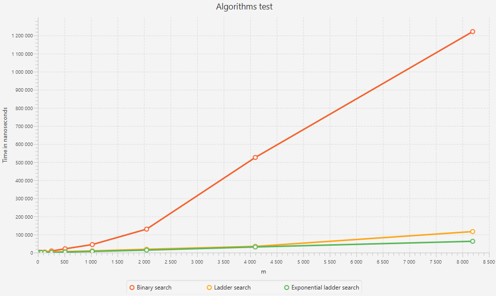

# Search algorithms research
Было протестировано три алгоритма поиска:

1. *Бинарный поиск по каждой строке матрицы.*
2. *Лестничный поиск*
3. *Лестничный но с экспоненциальным поиском по горизонтали*

Тесты проводились на матрице M x N. M = 2^x, N = 2^13. 
Формировалась матрица двумя способами:

1. A[i][j] = (N / M * i + j) * 2
2. A[i][j] = (N / M * i * j) * 2

## Запуск
- Java 21
- Java FX 1
1. Скачать java https://www.oracle.com/cis/java/technologies/downloads/.
2. Скачать java fx https://gluonhq.com/products/javafx/
3. Склонировать репозиторий. 
   ```git
    git clone <link>
    ```
4. Пройти в папку с кодом.
    ```cmd
    cd algorithms_lab1/src/main/java
    ```
5. Скомпилировать программу.
    ```cmd 
    javac --module-path "path to java fx lib folder" --add-modules javafx.controls,javafx.fxml -jar ru/ns/alg_lab/*
    ```
6. Запустить программу.
    ```cmd 
    javac --module-path "Path to java fx lib folder" --add-modules javafx.controls,javafx.fxml ru/ns/alg_lab/Main <gen_type>
    ```
   get_type - Способ генерации входных данных (1 или 2)

## Способ 1
Вообщем картина выглядит так. При увеличение данных бинарный поиск начинает сильно отставать от остальных.
Так же лестничный и с експоненциальных идут довольно близко но можно заметить, что экспоненциальный медленне увеличивает 
время исполнение чем просто лестничный. 
## Способ 2
При втором способе картина мало чем отличается от первого. 