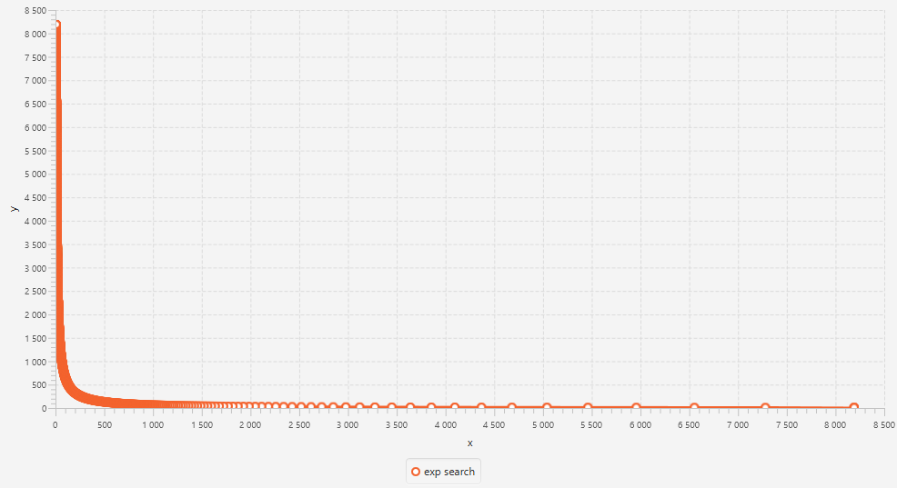
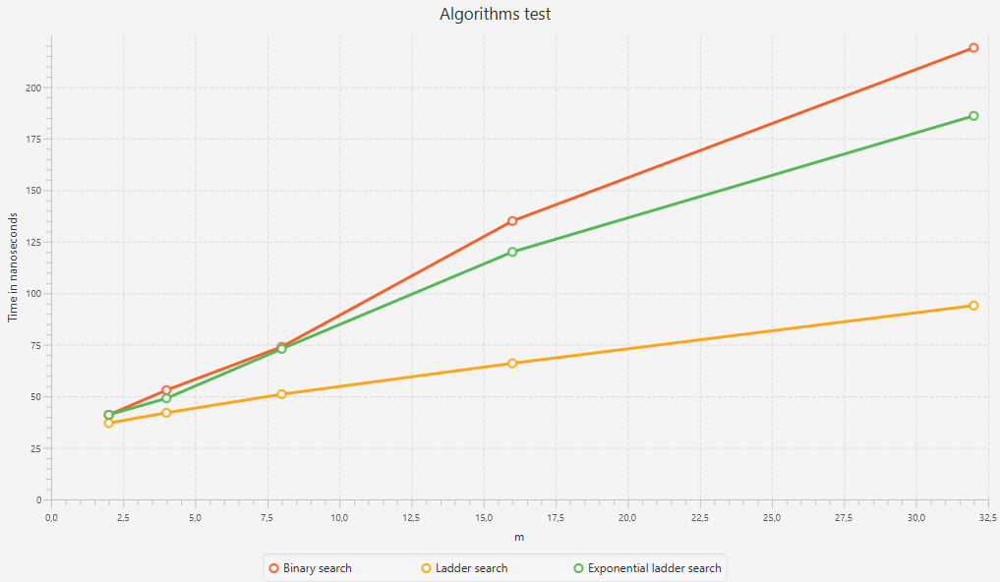

# Search algorithms research
Было протестировано три алгоритма поиска:


1. *Бинарный поиск по каждой строке матрицы.*
2. *Лестничный поиск*
3. *Лестничный, но с экспоненциальным поиском по горизонтали*


Тесты проводились на матрице $M{\times}N$. $M = 2^x, N = 2^{13}.$
Формировалась матрица двумя способами:
1. $A[i][j] = (N / M * i + j) * 2$
2. $A[i][j] = (N / M * i * j) * 2$


С искомым элементом:
1. $target = 2 * n + 1$
2. $target = 16 * n + 1$


## Запуск
**Технологии:**
- *Java 21*
- *JavaFX*


**Ручной запуск:**
1. Скачать *Java 21* https://www.oracle.com/cis/java/technologies/downloads/.
2. Добавить путь к *bin* в переменную среды PATH.
3. Скачать *JavaFX* https://gluonhq.com/products/javafx/
4. Клонировать репозиторий.
   ```git
    git clone https://github.com/DaVinChil/algorithms_lab1.git
    ```
5. Пройти в папку с кодом.
    ```cmd
    cd algorithms_lab1/src/main/java
    ```
6. Скомпилировать программу.
    ```cmd
    javac --module-path "path to java fx lib folder" --add-modules javafx.controls,javafx.fxml -jar ru/ns/alg_lab/*
    ```
7. Запустить программу.
    ```cmd
    java --module-path "Path to java fx lib folder" --add-modules javafx.controls,javafx.fxml ru/ns/alg_lab/Main <gen_type>
    ```
   get_type - Способ генерации входных данных (1 или 2)


**Автоматизированный запуск:**
1. Скачать *Java 21* https://www.oracle.com/cis/java/technologies/downloads/.
2. Клонировать репозиторий.
    ```git
    git clone https://github.com/DaVinChil/algorithms_lab1.git
    ```
3. Добавить путь к *bin* в переменную среды PATH.
4. Запустить программу.
   - PowerShell
        ```cmd
        .\mvnw clean javafx:run
        ```
   - Command line
        ```cmd
        mvnw clean javafx:run
        ```
*При использовании данного подхода, чтобы изменить способ генерации матрицы и искомого элемента, пройдите в класс ___Gen2DArray___ и измените значение поля ___genType___ на необходимое.*


## Обзор алгоритмов
- ***Бинарный поиск***. Проходим по каждой строке бинарным поиском. $O(mlog(n))$
- ***Лестничный поиск***. Начинаем с верхнего правого угла и двигаемся вниз или влево, если нынешний элемент меньше или больше искомого соответственно, пока не найдем элемент или выйдем за границы матрицы. $O(m+n)$
- ***Экспоненциальный лестничный поиск***. Тоже что и лестничный только при движении влево, вместо итерации ищем положение экспоненциальным поиском. $O(m(log(\frac{n}{m}) + 1))$


## Генерация 1
**При генерации таблицы по первой формуле $A[i][j] = (N/M * i + j) * 2$. В общем картина выглядит так.**

*Overall gen1*
#### Бинарный поиск
Искомый элемент отсутствует в таблице, следовательно, поиск проходит по каждой из m строк. Отсюда легко вывести асимптотическую сложность - $O(mlog(n))$. Так как данный алгоритм не учитывает, что таблица также возрастает и вертикально, можно заметить как при увеличении входных данных бинарный поиск сильно отстает.
#### Лестничный поиск
С искомым элементом $2n+1$ все элементы что ниже побочной диагонали больше искомого, а те что выше - меньше, поэтому алгоритмы идет четко по пути подобному лестнице из правого верхнего в левый нижний угол. Из чего сложность алгоритма равна $O(m+n)$.
#### Экспоненциальный лестничный поиск
Так движение при поиске элемента мы идем словно по ступеням, а стороны матрицы на начальных данных имеют высокое соотношение, из чего следует что движение по горизонтали на каждой ступени равно $N/M$ шагов. В отличие от обычного лестничного поиска данный алгоритм использует использовать экспоненциальный поиск для продвижения горизонтально, следовательно, должен показывать лучшее время при ассиметричном соотношении $M$ и $N$. Однако когда матрица приближается к квадратному виду движение по горизонтали равно единице, что накладывает большие дополнительные издержки на вызов экспоненциально поиска на каждой строчке, чтобы сместиться на единицу, что идентично итерации лестничного поиска, но в отличие от бинарного вызов производиться с каждым разом на более коротком отрезке. Отсюда сложность $O(m(log(n/m)+1))$.


*Несмотря на то, что при малых данных экспоненциальный поиск должен быть быстрее, но мы видим как он отстает, скорее всего из-за погрешности низкоуровневых операций.*

*Algorithms on small data*
## Генерация 2
**При генерации таблицы по первой формуле $A[i][j] = N/M * i * j * 2$. В общем картина выглядит так.**

*Overall gen2*
### Бинарный поиск
Искомый элемент также отсутствует в матрице, следовательно, результаты и асимптотика ничем не отличается от первой генерации.
### Лестничный и экспоненциальный
При данной генерации и искомом элементе движение поиска похоже на график функции $\sqrt{x}$. На малых данных поиск схож на ступеньки, но с увеличением входных данных поначалу движение горизонтально идем крупными шагами(*рис. Exp search moving*) что обеспечивает преимущество экспоненциальному поиску, однако далее продвижение по $x$ сильно сокращается, что, как обсуждалось в первой генерации, накладывает крупные издержки.



*Exp search moving.*


Однако не большое преимущество сначала дает, как видно на графике общей картины, экспоненциальному поиску выровняться с лестничным.


*На малых данных результаты мало чем отличается от первого способа.*

*Algorithms on small data*
