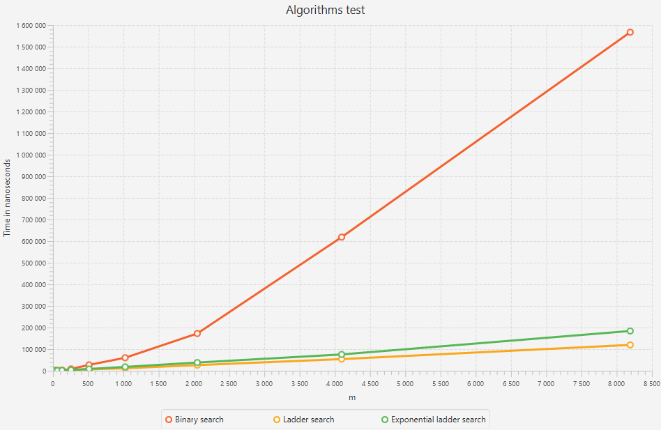
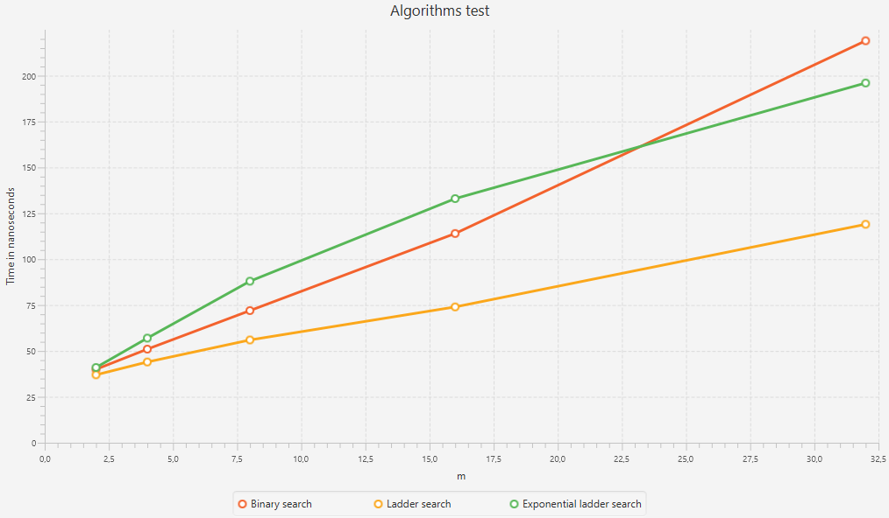
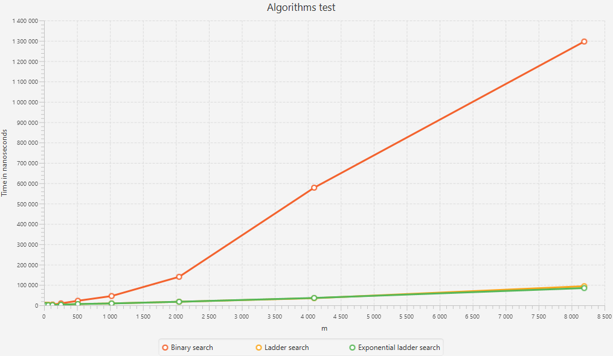

# Search algorithms research
Было протестировано три алгоритма поиска:

1. *Бинарный поиск по каждой строке матрицы.*
2. *Лестничный поиск* 
3. *Лестничный но с экспоненциальным поиском по горизонтали*

Тесты проводились на матрице M x N. M = 2^x, N = 2^13. 
Формировалась матрица двумя способами:

1. A[i][j] = (N / M * i + j) * 2
2. A[i][j] = (N / M * i * j) * 2

С искомым элементом:
1. target = 2*n+1
2. target = 16*n+1

## Запуск
Технологии:
- Java 21
- Java FX 1

По шагам:
1. Скачать java https://www.oracle.com/cis/java/technologies/downloads/.
2. Скачать java fx https://gluonhq.com/products/javafx/
3. Склонировать репозиторий. 
   ```git
    git clone <link>
    ```
4. Пройти в папку с кодом.
    ```cmd
    cd algorithms_lab1/src/main/java
    ```
5. Скомпилировать программу.
    ```cmd 
    javac --module-path "path to java fx lib folder" --add-modules javafx.controls,javafx.fxml -jar ru/ns/alg_lab/*
    ```
6. Запустить программу.
    ```cmd 
    javac --module-path "Path to java fx lib folder" --add-modules javafx.controls,javafx.fxml ru/ns/alg_lab/Main <gen_type>
    ```
   get_type - Способ генерации входных данных (1 или 2)

## Обзор алгоритмов


## Генерация 1
**При генерации таблицы по первой формуле *A[i][j] = (N/M * i + j) * 2*. В общем картина выглядит так.**

#### Бинарный поиск
Искомый элемент отсутсвует в таблице, следовательно поиск проходит по каждой из m строк. Отсюда легко вывести  асимптотическую сложность - O(*m*log(*n*)). Так как данный алгоритм не учитывает, что таблица так же возрастает и вертикально, можно заметить как при увеличении входных данных бинарный поиск сильно отстает. 
#### Лестничный поиск
По формуле левый нижний элемент равен *2n*, a искомый элемент *2n+1*, поэтому алгоритмы идет четко по пути подобному лестнице из право верхнего в левый нижний угол. Из чего сложность алгоритма равна *O(m+n)*.
#### Экспоненциальный лестничный поиск
Так движение при поиске элемента мы идем словно по ступеньками, а соотношения сторон матрица на начальных данных прямоугольная, движение по горизонтали на каждой ступеньки равно *N/M* шагов. В отличии от обычного лестничного поиска данный алгоритм использует успользует экспоненциальный поиск для продвижения горизонтально, следовательно должен показывать лучшее время при ассимитричном соотношении _M_ и _N_. Однако когда матрица матрица приближаеться к квадратному виду продвижение по горризонтали равно единице, все больше накладываеться дополнительные издержки на вызов экспоненциально поиска на каждой строчке, что бы сместиться на единцу, что идентично итерации лестничного поиска, но в отличии от бинарного вызов производиться с каждым разом на более коротком отрезке. Отсюда сложность *O(mlog(n/m))*.

Не смотря на то что при малых данных экспоненциальный поиск должен быть быстрее, мы видим как он отстает, скорее всего из за погрешности низкоуровневых операций.

## Генерация 2
При втором способе картина относительно бинарного поиска мало чем отличается. Однако ладдер и экспоненциальный идут вместе. Так как искомый элемент больше любого элемента в массиве, при поиске мы постоянно смещаемся вниз и экспоненциальный поиск по горизонтали не вызывается, что делает их индентичными.

На малых данных результаты не отличается  от первого способа.
